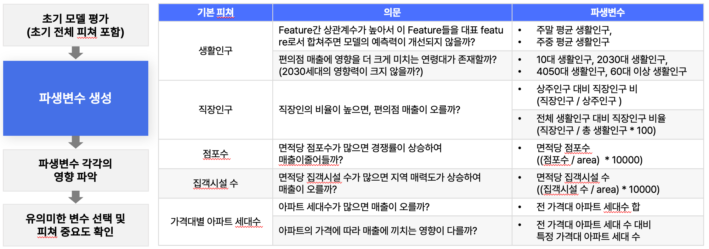

# Semi Project

## 🏪 강남구 지역 상권 기반 시간대별 편의점 매출 예측

- 주제 : 편의점 운영 시간대 선택을 도와 운영 부담 감소를 위한 "강남구 지역 상권 기반 시간대별 매출 예측"

- 일정 : 2023/09/01 ~ 2023/09/26

- Value Trackers 팀 : 류민승, 김신우, 김성원, 한규동


### Requirements

---

- Language : Python 3.11.5

- Python Library

```
numpy==1.25.2
pandas==2.0.3
matplotlib==3.7.2
seaborn==0.12.2
plotly==5.9.0
scikit-learn==1.3.0
streamlit==1.24.1
lightgbm==3.3.5
joblib==1.2.0
shapley
streamlit_option_menu
folium
polygon
Shapely
pyproj
```


## 💡 프로젝트 결과

- 대시보드 링크 : [Streamlit_대시보드](https://procspredictor.streamlit.app/)

- **시간대 별 매출 시각화** : 상권과 분기를 선택시, 시간대별 편의점 예상 매출 확인 가능 ➡ 효율적인 매장 운영 시간 채택시 도움

- **모델링 시뮬레이션** : 시간대별 매출에 영향을 미치는 변수를 직접 조절하며 예측 결과를 확인할 수 있음


  

  

## 💡 기대효과

- 영업 시간대별 매출 예측으로 매장 운영시간 선택과 비용 절감 도모

- 효율적 자원배분 의사결정 도움(인력 계획 및 재고 관리)

- 창업 시 입점 지역 선택 시, 예상 비용과 매출을 고려할 수 있는 자료 제공

---

  


### 1. 주제 선정 배경

- 과열되는 경쟁 속의 편의점 : 지역 점포당 매출은 감소하며 폐업 수는 증가

- 전기요금, 인건비 등 관리비 요금의 지속적 증가로 심해지는 영업 부담

- 24시간 계약을 유도하는 브랜드에 대해 현실적으로 매출을 예측하고 영업시간을 선택할 수 있는 기준의 부재

> **주제의 목적 및 필요성**
>  👉 매장 운영 효율성 증가 및 손익 판단을 위한 입지 기반 매출 정보 제공 필요  

  

  

### 2. 분석 대상 선정(강남구)

- 분산 분석을 통해 서울시 서로 다른 상권 4개를 기준, 시간대별 매출에 통계적 차이가 있음을 확인

- 개업 대비 폐업 수가 가장 많은 **강남구** ➡ 경쟁이 심화되며 매출은 줄어드는 현실 반영

  

  

### 3. 분석 프로세스

- 데이터 수집 ➡ 전처리(이상치, 결측치) ➡ 상권코드 기반 분기별, 시간별 데이터 매핑 ➡ 상권 군집화 시도(K-means Clustering) ➡ 골목/비골목 상권 기반 모델링 채택

- Feature Engineering을 통한 파생변수 생성 및 최종 변수 채택

- LightGBM을 활용한 모델링 및 하이퍼 파라미터 설정

- 최종 예측 모델 도출 및 성과 확인(RMSE)

- Streamlit 대시보드 및 프레젠테이션 자료 작성

  

  

### 4. 데이터 종합


  

### 5. Feature Engineering

#### (1) 파생변수 생성

- 초기 모델링 평가 후, 성능 개선을 위한 feature engineering 시행

- 기본 피처를 분석하여 유의미 할 것으로 예상되는 파생변수를 생성하고 변수 선택 시행




#### (2) 변수 선택

- 선택 방법 : 전진선택법 & 후진제거법을 결합한 단계적선택법 활용

- 파생변수 각각의 예측 성능 영향도 확인


- 파생변수와 초기변수 전체의 예측 성능을 고려하여 변수 선택


  

  

### 6. 모델링

- 비교적 짧은 학습 시간과, 예측 오류 손실을 최소화 

- 대용량 데이터에 뛰어난 예측 성능

- 단, 전체 데이터 개수가 적을 경우 과적합 우려
  
  **👉 K-fold 교차 검증
  👉 RandomSearchCV 로 하이퍼파라미터 튜닝**

  

  

### 7. 평가 지표 선택(RMSE)

- 종속변수(매출액)의 왜도 : 약 2.5

- 균일하지 않은 분포의 데이터셋 예측 성능 측정을 위해 **RMSE 선택**
  


### 8. 모델링 결과

> ##### 골목상권 예측 성능 오류 개선
> 
> RMSE 42666 ➡ 41951
> 
> ##### 비골목상권 예측 성능 오류 개선
> 
> RMSE 42666 ➡ 33248


